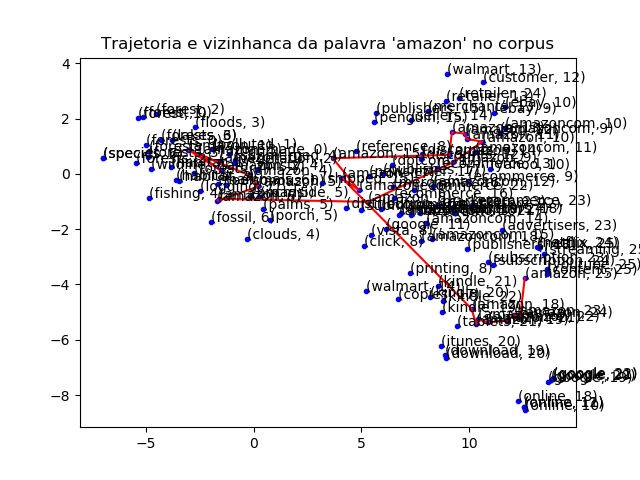

DynamicWord2Vec
===

> Este repositório é um fork do trabalho que gerou o artigo [Dynamic Word Embeddings for Evolving Semantic Discovery](https://arxiv.org/abs/1703.00607).

O objetivo deste repositório é reproduzir o trabalho de Zijun Yao, et al. e explorar o uso de word embeddings no estudo da evolução semantica das palavras. Alguns ajustes foram feitos em algumas das rotinas para permitir:

* Facilitar a reprodução das figuras do artigo
* Facilitar a exploração das possibilidades do uso de embeddings

## Requisitos

* [Anaconda](https://www.anaconda.com/) - distro python

A definição do ambiente python necessário a reprodução do trabalho está nos formatos anaoncda: [bimt_env.yml](bimt_env.yml) e pip: [requirements.txt](requirements.txt)

## Dados

Os autores do artigo disponibilizaram os dados que utilizaram. Pra obtê-los:

```shell
wget https://www.dropbox.com/s/6q5jhhmxdmc8n1e/data.zip?dl=0
unzip data.zip
```

Nesta pasta, são relevantes os seguintes arquivos:

1. **wordPairPMI_*.csv** - arquivo em formato csv com o valor do PMI para cada par de palavras em uma certa vizinhança do corpus.
2. **wordIDHash.csv** - arquivo em formato csv contendo o índice reverso das palavras no corpus. Para cada palavra o arquivo contém um ordinal, na primeira coluna, que representa a palavra.

## Estrutura

A estrutura do repositório

* [embeddings](./embeddings) - embeddings in loadable MATLAB files. 0 corresponds to 1990, 1 to 1991, ..., 19 to 2009. To save space, each year's embedding is saved separately. When used in visualization code, first merge to 1 embedding file.
* [train_model](./train_model) - contains code used for training our embeddings data file download: https://www.dropbox.com/s/nifi5nj1oj0fu2i/data.zip?dl=0
* [other_embeddings](./other_embeddings) - contains code for training baseline embeddings data file download: https://www.dropbox.com/s/tzkaoagzxuxtwqs/data.zip?dl=0
  * [staticw2v.py](./other_embeddings/staticw2v.py) - static word2vec (Mikolov et al 2013)
  * [aw2v.py](./other_embeddings/aw2v.py) - aligned word2vec (Hamilton, Leskovec, Jufarsky 2016)
  * [tw2v.py](./other_embeddings/tw2v.py) - transformed word2vec (Kulkarni, Al-Rfou, Perozzi, Skiena 2015)
* [visualization](./visualization) - scripts for visualizations in paper
 
* [distorted_smallNYT](./distorted_smallNYT) - code for robust experiment data file download: https://www.dropbox.com/s/6q5jhhmxdmc8n1e/data.zip?dl=0

## Treinamento

> As rotinas de treinamento supõem a existência de uma pasta ```results``` na raiz do projeto.

os scripts de treinamento permitem encontrar os Dynamic Embeddings que resolvem o problema de otimização definido no atigo. Os hiperparâmetros importantes para o trenamento são:

* ITERS: número de épocas do treinamento
* lam: frob regularizer
* gam: forcing regularizer
* tau: smoothing regularizer
* r: dimensão dos embeddings
* b: batch size
* emph: emphasize the nonzero

Os parâmetros de regularização são bem descritos no artigo, assim como seus valores típicos, o tamabho do batch pode ser ajustado conforme os recursos disponíveis.

Após executado o treinamento os embeddigns para cada uma das iterações serão salvos na pasta de saída. Eles devem ser processados utilizando a rotina [prepare_embeddings.py](./train_model/prepare_embeddings.py) para agrupá-los em um único arqivo (serializado) que é utilizado em outros scripsts.

## Visualização

A rotina de visualização cria gárficos das trajetórias dos embeddings mapeados para um plano 2D usitilizando a técnica [T-SNE](https://en.wikipedia.org/wiki/T-distributed_stochastic_neighbor_embedding). Nesta visualização podemos observar a vizinhança da trajetória de uma "palavra-alvo" e assim observar a variação de seu valor semântico. Para executar o script

```shell
python visualization/trajectories.py --target-word amazon
```

Gera seguinte saída na pasta result:

<p align="center">
    
</p>